# Data Structures Module (`lib/ds/`)

This module implements fundamental data structures in C, each with dynamic memory management and proper cleanup functions.

---

## 1. Dynamic Array (`array.h`)

A resizable array of integers that automatically doubles its capacity when full.

### Structure

```c
typedef struct {
    int *items;      // Dynamic array of integers
    size_t count;    // Current number of elements
    size_t capacity; // Allocated capacity
} Nums;
```

### Mermaid Diagram: Array Structure & Resize Flow

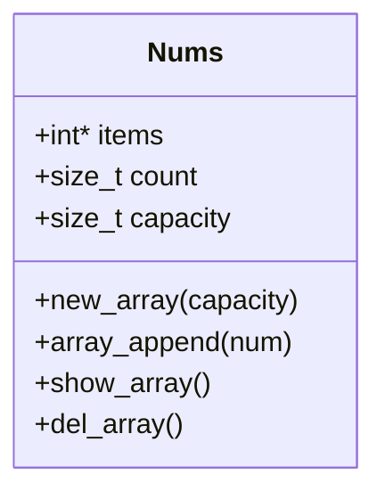

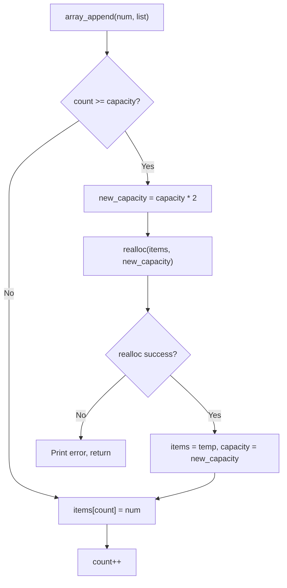

### API Reference

| Function | Description |
|----------|-------------|
| `new_array(capacity)` | Creates a new array with initial capacity. Returns `NULL` if capacity < 1. |
| `array_append(num, list)` | Appends an integer. Auto-resizes if full (doubles capacity). |
| `show_array(list)` | Prints all elements in format `[ 1, 2, 3 ]`. |
| `del_array(list)` | Frees the items array and the Nums struct. |

### Usage Example

```c
Nums* list = new_array(5);
array_append(10, list);
array_append(20, list);
array_append(30, list);
show_array(list);  // [ 10, 20, 30 ]
del_array(list);
```

### Memory Behavior

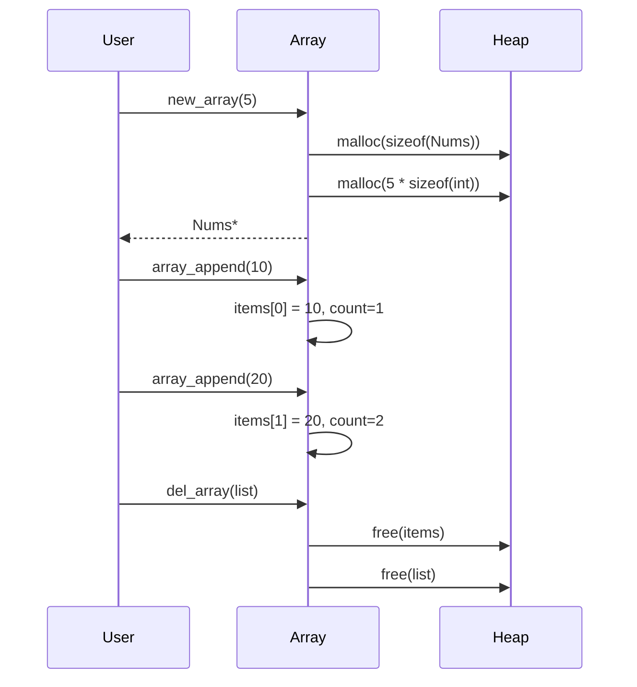

---

## 2. Circular Linked List (`circular.h`)

A singly-linked list where the last node points back to the first, forming a cycle.

### Structures

```c
typedef struct Node {
    int value;
    node_t *next;
} node_t;

typedef struct List {
    int count;
    node_t *head;
} list_t;
```

### Mermaid Diagram: Circular List Structure

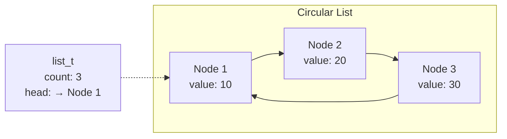

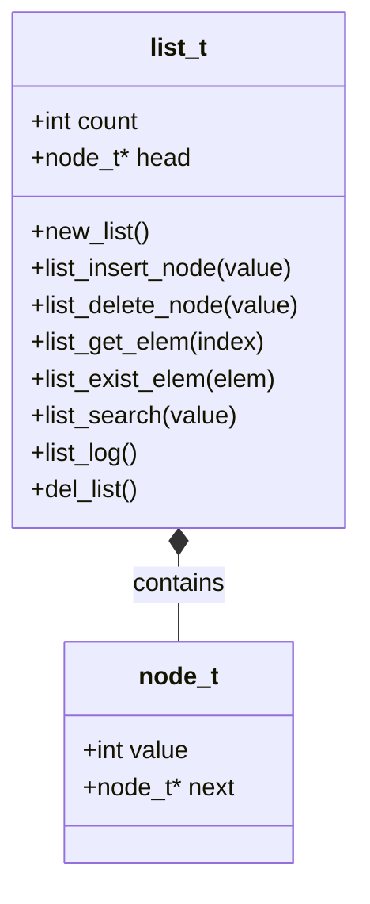

### API Reference

| Function | Description |
|----------|-------------|
| `new_node(val)` | Creates a new node with the given value. |
| `new_list()` | Creates an empty circular list. |
| `list_insert_node(list, value)` | Inserts a new node at the end of the circular list. |
| `list_delete_node(list, value)` | Deletes the first node with the matching value. |
| `list_get_elem(list, index)` | Returns element at 1-based index, or -1 if out of bounds. |
| `list_exist_elem(list, elem)` | Returns 1 if element exists, 0 otherwise. |
| `list_search(list, value)` | Searches and prints position of value. |
| `list_log(list)` | Prints all elements and count. |
| `list_get_items(list)` | Returns a new array with all elements (caller must free). |
| `del_list(list)` | Frees all nodes and the list container. |

### Insert Operation Flow

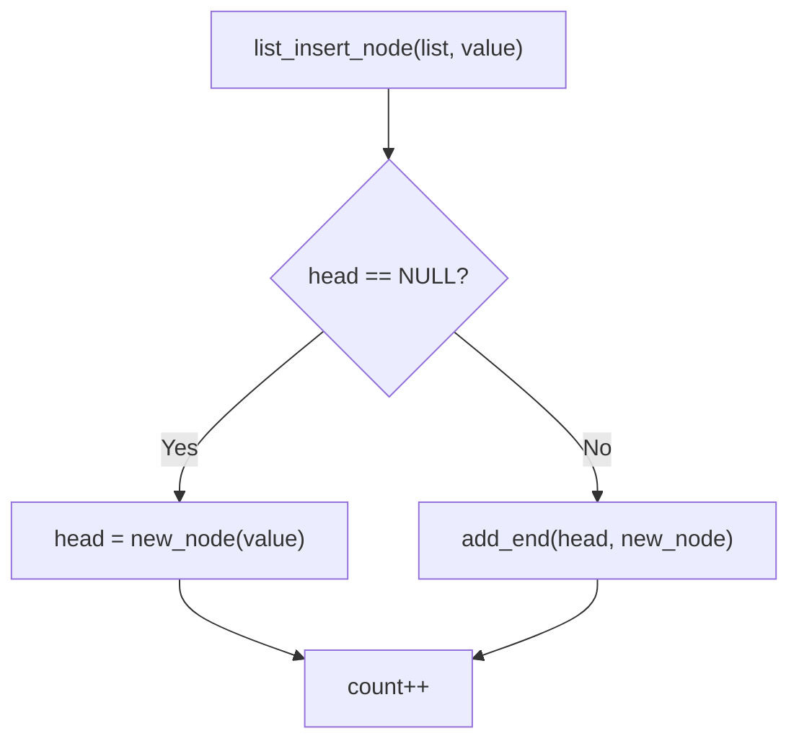

---

## 3. Stack (`stack.h`)

A LIFO (Last In, First Out) stack implemented with a linked list, designed for character storage. Includes standard and automaton variants of push/pop.

### Structures

```c
typedef struct Elem {
    char value;
    elem_t* next;
} elem_t;

typedef struct Stack {
    int count;
    elem_t* top;
} stack_t;
```

### Mermaid Diagram: Stack Operations

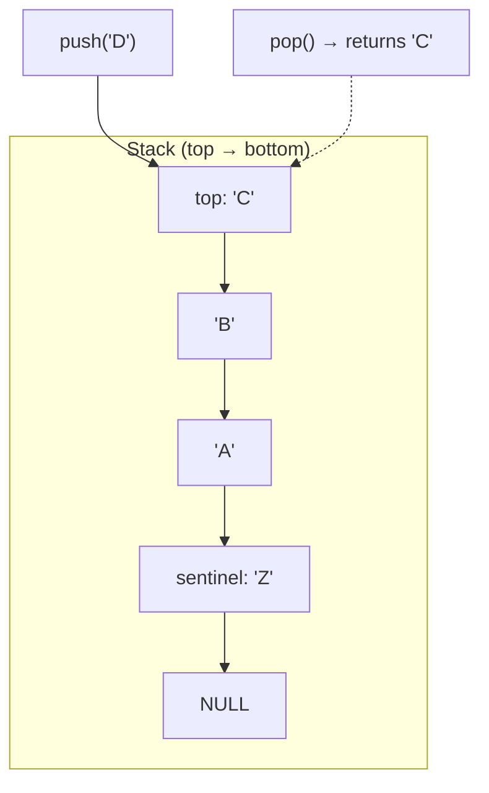

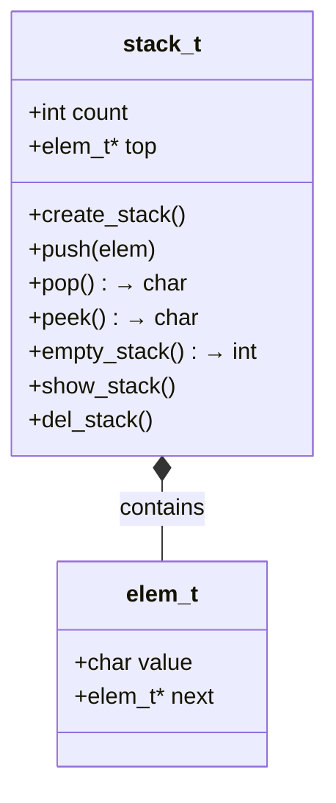

### Standard vs Automaton Operations

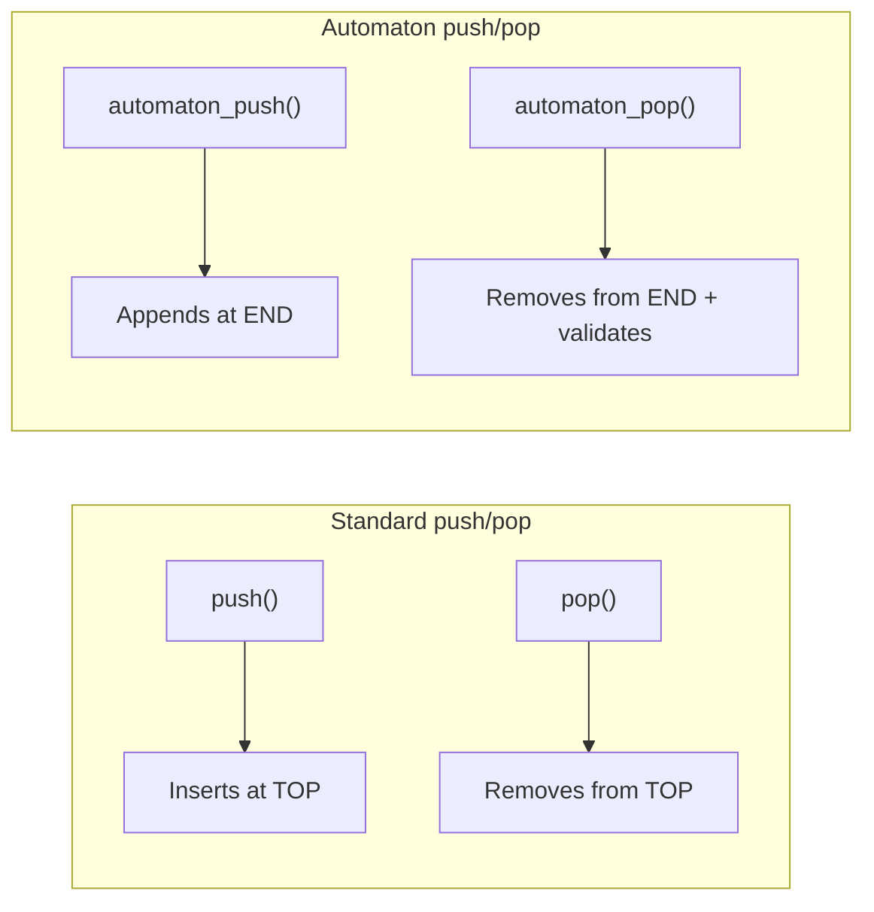

### API Reference

| Function | Description |
|----------|-------------|
| `create_stack()` | Creates a new stack with a sentinel element ('Z'). |
| `push(stack, elem)` | Pushes a character onto the top. |
| `pop(stack)` | Removes and returns the top character. |
| `peek(stack)` | Returns the top character without removing it. |
| `empty_stack(stack)` | Returns 1 if stack is empty, 0 otherwise. |
| `automaton_push(stack, elem)` | Appends to the end (for parenthesis automaton). |
| `automaton_pop(stack, elem, position)` | Pops from end, validates expected char, reports errors. |
| `show_stack(stack)` | Prints all stack elements. |
| `del_stack(stack)` | Frees all elements and the stack container. |

### Usage Example

```c
stack_t* st = create_stack();
push(st, 'A');
push(st, 'B');
push(st, 'C');
show_stack(st);    // stack -> { C, B, A, Z }
char top = peek(st);  // 'C'
pop(st);           // removes 'C'
del_stack(st);
```

---

## 4. Binary Search Tree (`tree.h`)

A binary search tree (BST) where left children contain lesser values and right children contain greater or equal values.

### Structures

```c
typedef struct TreeNode {
    int value;
    tree_node_t* right;
    tree_node_t* left;
} tree_node_t;

typedef struct Tree {
    tree_node_t* root;
    int items;
} tree_t;
```

### Mermaid Diagram: BST Structure

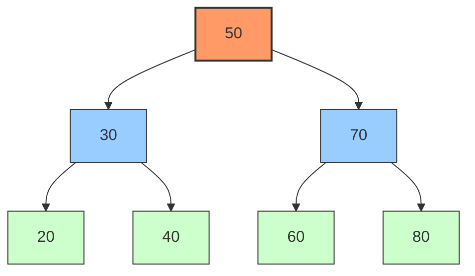

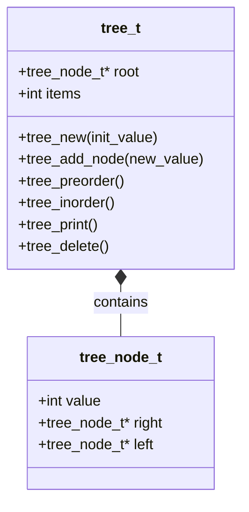

### Traversal Orders

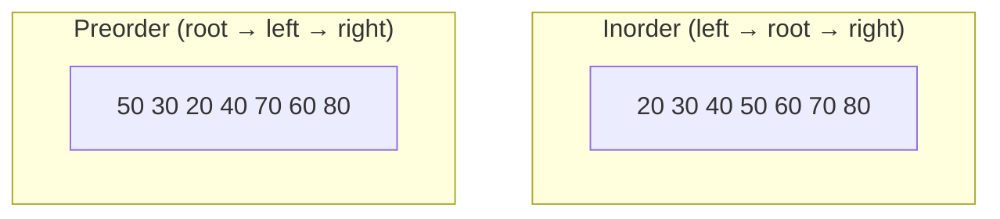

### Insert Algorithm

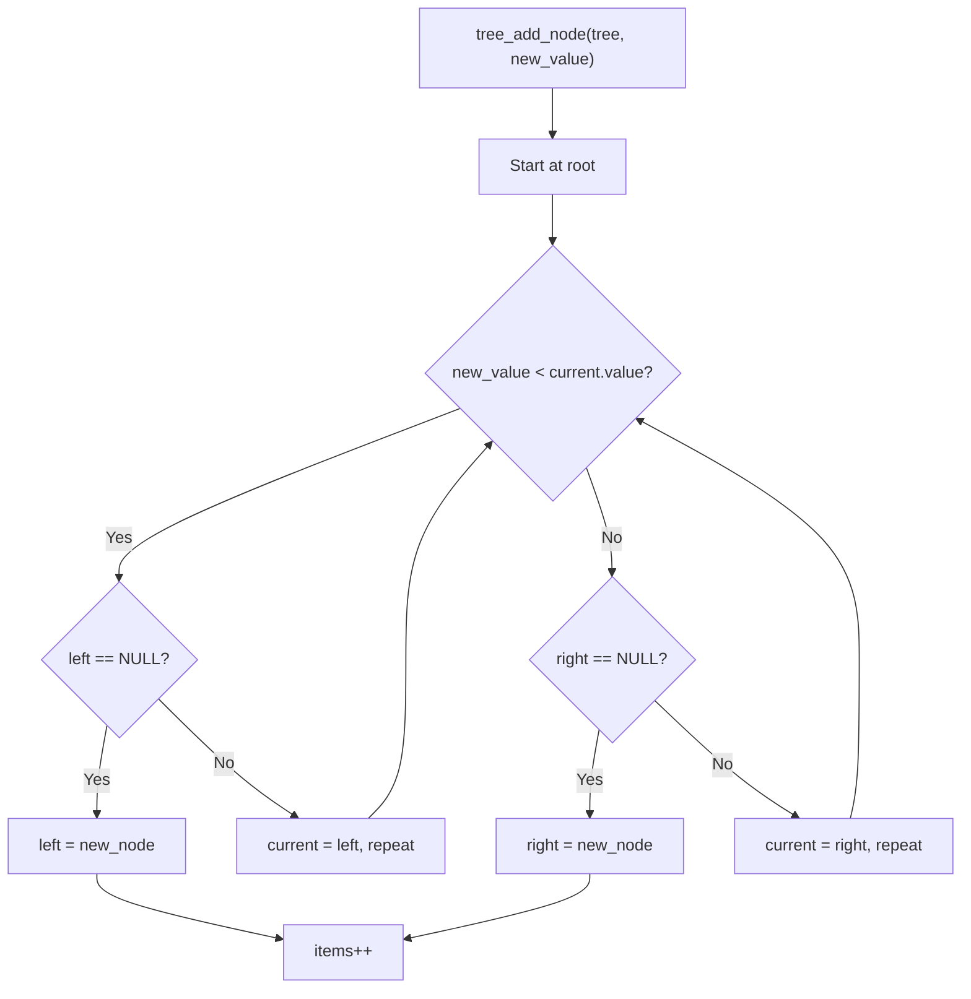

### API Reference

| Function | Description |
|----------|-------------|
| `tree_new(init_value)` | Creates a new tree with root containing init_value. |
| `tree_add_node(tree, new_value)` | Inserts a new node following BST rules. |
| `tree_preorder(tree)` | Prints tree in preorder traversal. |
| `tree_inorder(tree)` | Prints tree in inorder (sorted for BST). |
| `tree_print(tree)` | Prints visual tree with branch characters (├──, └──). |
| `tree_delete(tree)` | Recursively frees all nodes and the tree container. |

### Usage Example

```c
tree_t* tree = tree_new(50);
tree_add_node(tree, 30);
tree_add_node(tree, 70);
tree_add_node(tree, 20);
tree_add_node(tree, 40);

tree_inorder(tree);   // 20 30 40 50 70
tree_preorder(tree);  // 50 30 20 40 70
tree_print(tree);     // Visual tree output
tree_delete(tree);
```

---

## Module Overview Diagram

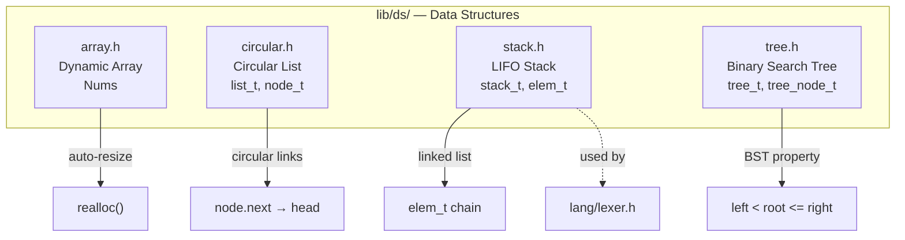
