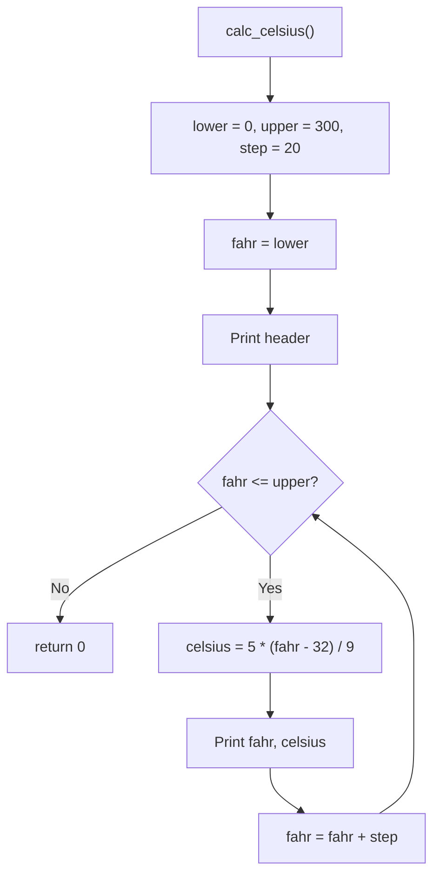
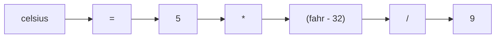
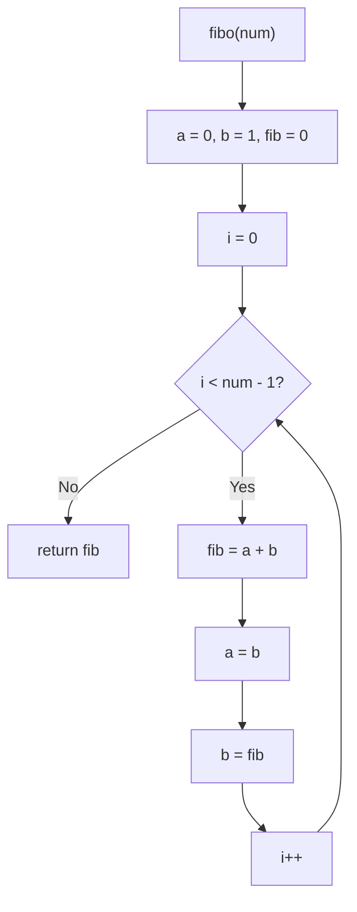
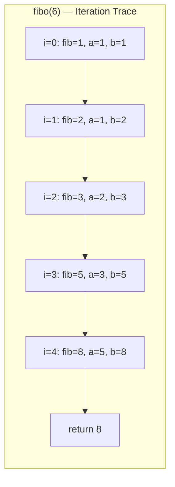
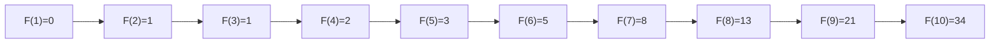
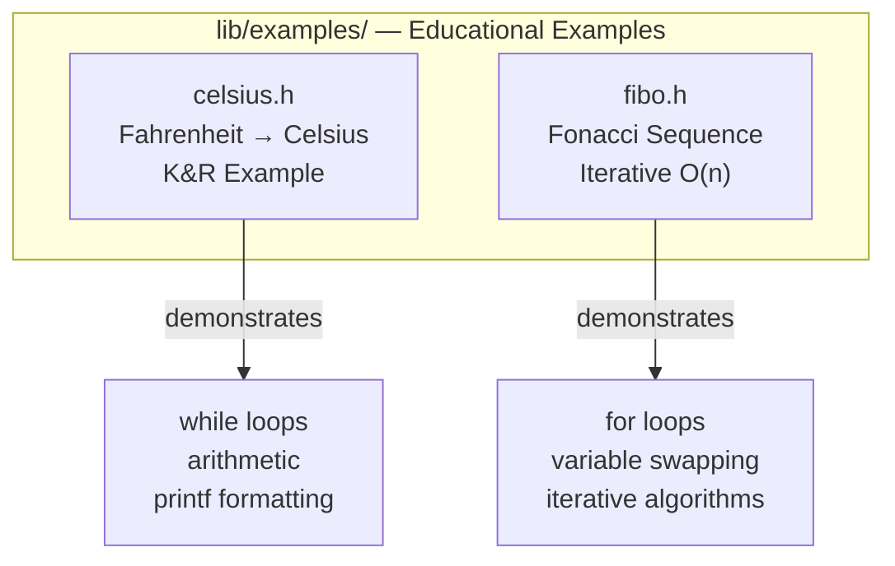

# Examples Module (`lib/examples/`)

This module contains educational examples demonstrating fundamental C programming concepts.

---

## 1. Celsius Conversion (`celsius.h`)

Prints a Fahrenheit-to-Celsius conversion table. This is a classic example from "The C Programming Language" by Kernighan & Ritchie (K&R).

### Mermaid Diagram: Algorithm Flow



### API Reference

| Function | Description | Return |
|----------|-------------|--------|
| `calc_celsius()` | Prints Fahrenheit-Celsius table from 0°F to 300°F in steps of 20°F | `int` - 0 on success |

### Output Example

```
	Fahrenheit	Celsious
	  0		  -17
	  20		  -6
	  40		  4
	  60		  15
	  80		  26
	  100		  37
	  ...
	  300		  148
```

### Conversion Formula



### Usage

```c
#include "lib/examples/celsius.h"

calc_celsius();
```

---

## 2. Fibonacci (`fibo.h`)

Calculates the nth Fibonacci number using an iterative (non-recursive) approach.

### Mermaid Diagram: Algorithm Flow



### API Reference

| Function | Description | Parameters | Return |
|----------|-------------|------------|--------|
| `fibo(num)` | Calculates the nth Fibonacci number iteratively | `int num` - position in sequence (1-based) | `int` - nth Fibonacci number |

### State Evolution



### Fibonacci Sequence



### Complexity

| Metric | Value |
|--------|-------|
| Time Complexity | O(n) |
| Space Complexity | O(1) |

### Usage

```c
#include "lib/examples/fibo.h"

int result = fibo(10);  // Returns 34
```

---

## Module Overview


