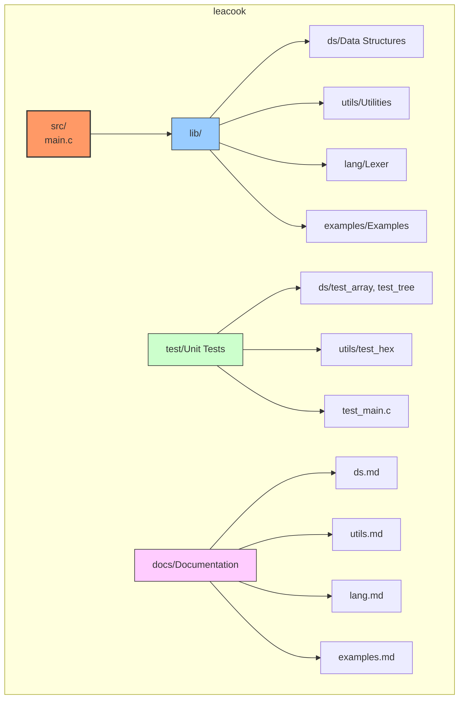
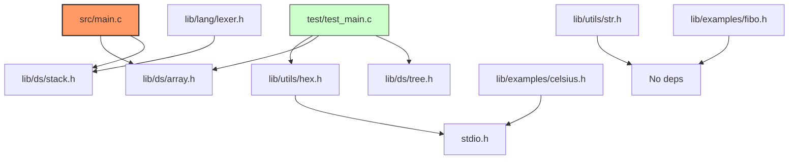
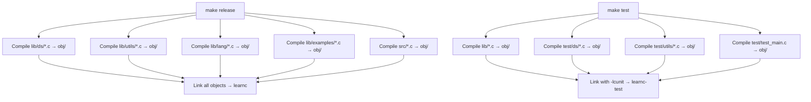
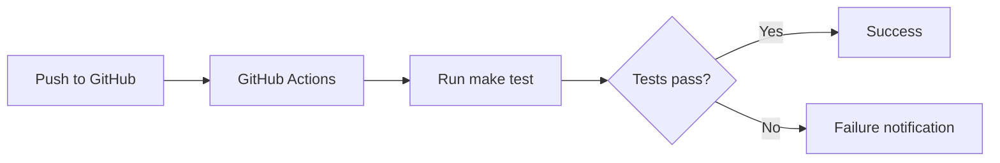

# leacook — Learning C Notes

Repository with notes and examples of research of the C programming language, including notes from "The C Programming Language" book.

---

## Project Structure



---

## Modules

| Module | Path | Description | Documentation |
|--------|------|-------------|---------------|
| **Data Structures** | `lib/ds/` | Array, Circular List, Stack, BST | [ds.md](ds.md) |
| **Utilities** | `lib/utils/` | Hex conversion, String operations | [utils.md](utils.md) |
| **Lexer** | `lib/lang/` | Tokenizer, Parenthesis validator | [lang.md](lang.md) |
| **Examples** | `lib/examples/` | Celsius table, Fibonacci | [examples.md](examples.md) |

---

## Module Dependency Graph



---

## Build System

### Makefile Targets

| Target | Description | Flags |
|--------|-------------|-------|
| `make` | Default build (no specific target) | - |
| `make debug` | Debug build with GDB support | `-Wall -Wextra -Werror -Og -ggdb` |
| `make release` | Optimized release build | `-Wall -Wextra -Werror -O2 -march=native` |
| `make test` | Build test suite (requires CUnit) | `-lcunit` |
| `make clean` | Remove all object files | - |
| `make usage` | Show help message | - |

### Build Flow



### Quick Start

```bash
# Build and run
./run.sh

# Or manually
make release
./learnc

# Run tests
make test
./learnc-test
```

---

## Testing

The project uses **CUnit** for unit testing.

### Test Suites

```mermaid
flowchart TD
    A["CUnit Test Registry"] --> B["Core Suite"]
    A --> C["Array Suite"]
    A --> D["Tree Suite"]

    B --> B1["test_val_hxchar"]
    B --> B2["test_from_hex"]
    B --> B3["test_upper"]

    C --> C1["test_new_array_valid"]
    C --> C2["test_new_array_invalid"]
    C --> C3["test_array_append_single"]
    C --> C4["test_array_append_multiple"]
    C --> C5["test_array_append_resize"]
    C --> C6["test_array_count_tracking"]
    C --> C7["test_array_no_leak"]

    D --> D1["test_tree_new"]
    D --> D2["test_tree_add_single"]
    D --> D3["test_tree_add_multiple"]
    D --> D4["test_tree_add_duplicate"]
    D --> D5["test_tree_items_count"]
    D --> D6["test_tree_inorder_sorted"]
    D --> D7["test_tree_preorder"]
    D --> D8["test_tree_delete"]
    D --> D9["test_tree_no_leak"]
```



### Test Coverage

| Module | Tests | Coverage |
|--------|-------|----------|
| **utils/hex** | 3 | `val_hxchar`, `from_hex`, `upper` |
| **ds/array** | 7 | Creation, append, resize, count, memory leak |
| **ds/tree** | 9 | Creation, insertion, counting, traversal, deletion, memory leak |

---

## Doxygen Documentation

All header files include Doxygen-style comments. To generate HTML documentation:

```bash
# Install doxygen
# Ubuntu/Debian: sudo apt install doxygen
# macOS: brew install doxygen

# Generate docs (if Doxyfile exists)
doxygen Doxyfile
```

### Doxygen Comment Format

```c
/**
 * @brief Brief description of the function.
 *
 * Detailed description of what the function does,
 * its behavior, and any important notes.
 *
 * @param param_name Description of the parameter.
 * @return Description of the return value.
 */
```

---

## CI/CD

The project uses GitHub Actions for continuous integration.



See `.github/workflows/tests.yml` for configuration.

---

## License

This project is for educational purposes — learning C programming.
