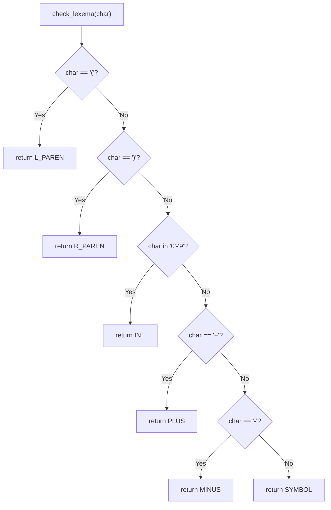
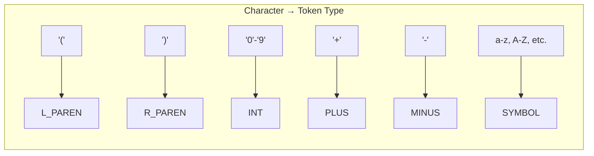
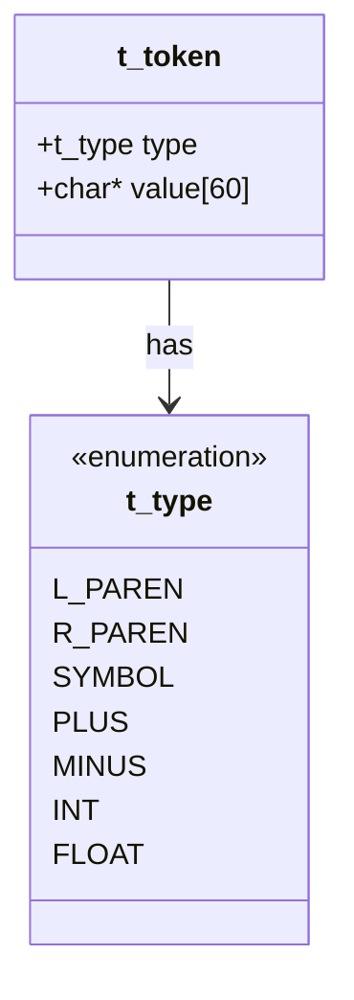
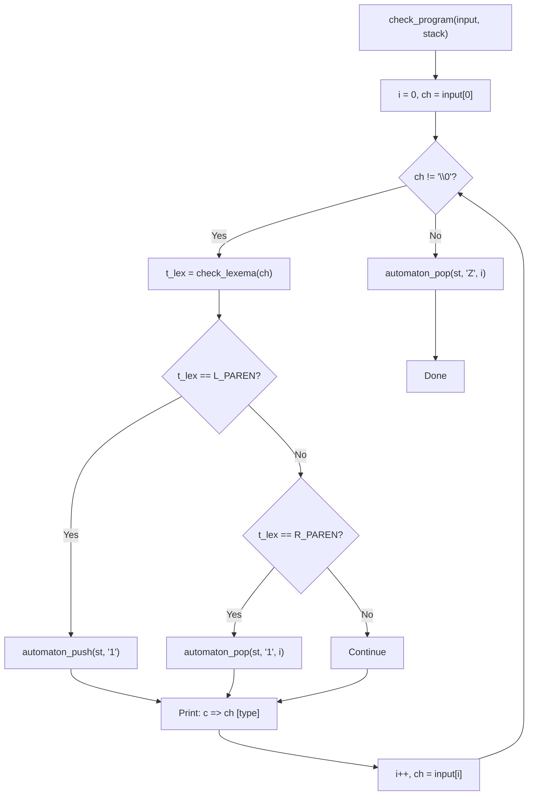
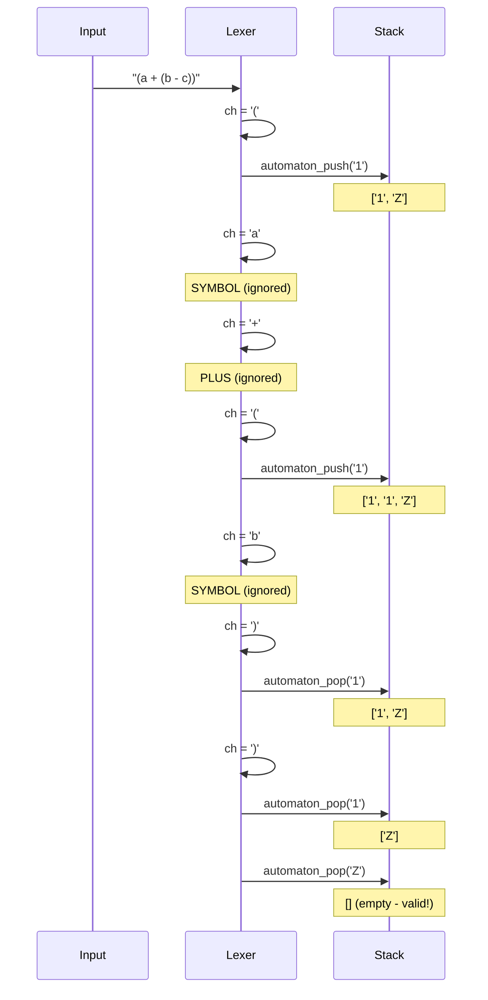
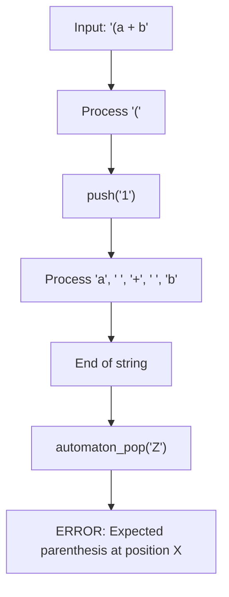
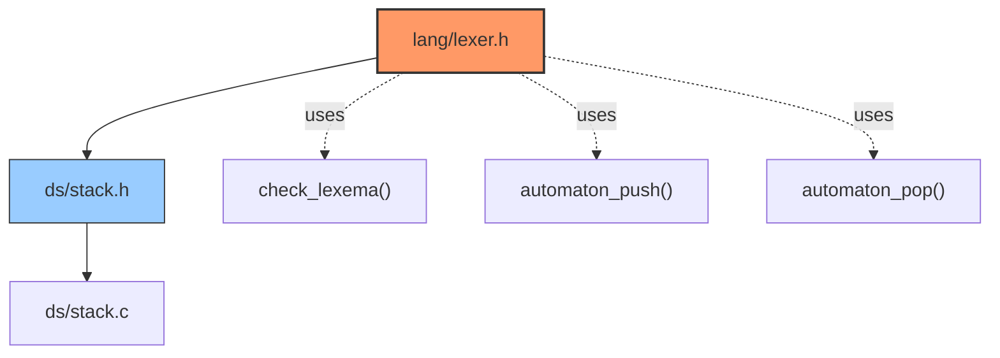

# Language/Lexer Module (`lib/lang/`)

This module implements a basic lexical analyzer (lexer) for simple arithmetic expressions, with a stack-based automaton for parenthesis validation.

---

## Token Types

The lexer recognizes the following token types:

```c
typedef enum {
    L_PAREN,    // '('
    R_PAREN,    // ')'
    SYMBOL,     // Alphabetic or other symbols
    PLUS,       // '+'
    MINUS,      // '-'
    INT,        // '0'-'9'
    FLOAT       // Floating point (reserved)
} t_type;
```

### Mermaid Diagram: Token Classification



### Token Type Mapping



---

## Structures

```c
typedef struct Token {
    t_type type;
    char* value[60];
} t_token;
```

### Mermaid Diagram: Token Structure



---

## Parenthesis Validation Automaton

The `check_program()` function uses a stack-based automaton to validate that parentheses in an input string are properly matched.

### Mermaid Diagram: Automaton Flow



### Stack State During Parenthesis Matching



---

## API Reference

| Function | Description | Parameters | Return |
|----------|-------------|------------|--------|
| `check_lexema(lexema)` | Classifies a single character into its token type | `char lexema` - character to classify | `t_type` - token type enum |
| `check_program(input, st)` | Validates parenthesis matching using stack automaton | `char* input` - string to analyze<br>`stack_t* st` - stack for tracking | `void` |

### `lexema_str()` Helper (internal)

Converts a `t_type` enum to its string representation for logging:

| Token Type | String Output |
|------------|---------------|
| `L_PAREN` | `"L_PAREN"` |
| `R_PAREN` | `"R_PAREN"` |
| `SYMBOL` | `"SYMBOL"` |
| `PLUS` | `"PLUS"` |
| `MINUS` | `"MINUS"` |
| `INT` | `"INT"` |
| `FLOAT` | `"FLOAT"` |
| other | `"NIL"` |

---

## Usage Example

```c
#include "lib/lang/lexer.h"
#include "lib/ds/stack.h"

stack_t* st = create_stack();
char* input = "(a + (b - c))";

check_program(input, st);
// Output:
// c => ( [L_PAREN]
// c => a [SYMBOL]
// c =>   [SYMBOL]
// c => + [PLUS]
// c =>   [SYMBOL]
// c => ( [L_PAREN]
// c => b [SYMBOL]
// c =>   [SYMBOL]
// c => - [MINUS]
// c =>   [SYMBOL]
// c => c [SYMBOL]
// c => ) [R_PAREN]
// c => ) [R_PAREN]

del_stack(st);
```

### Error Case: Unmatched Parenthesis



---

## Module Dependencies


