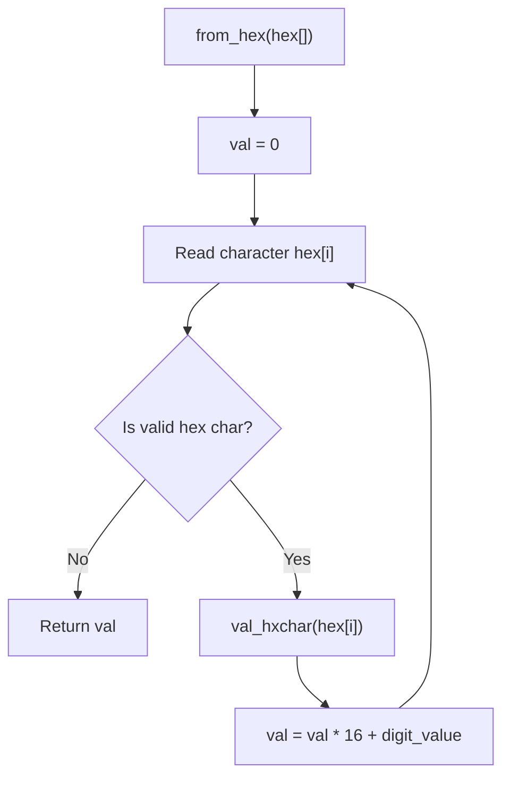
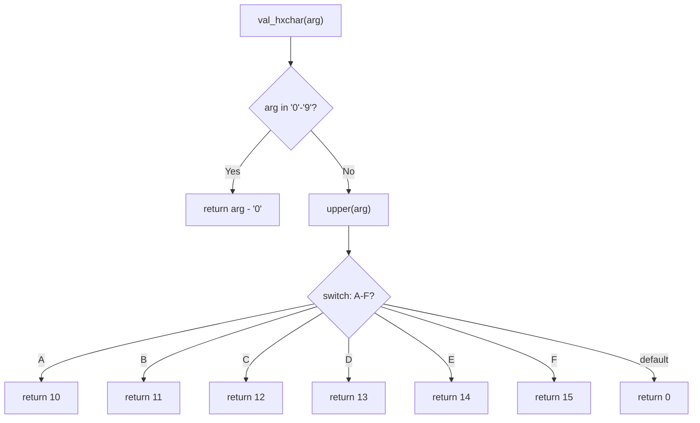
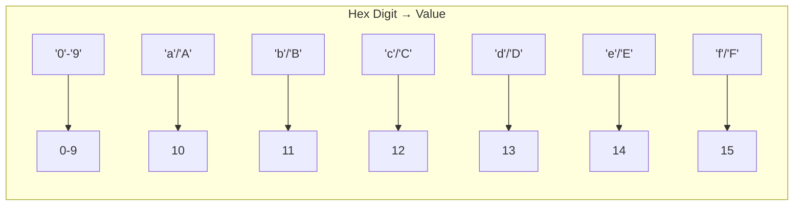
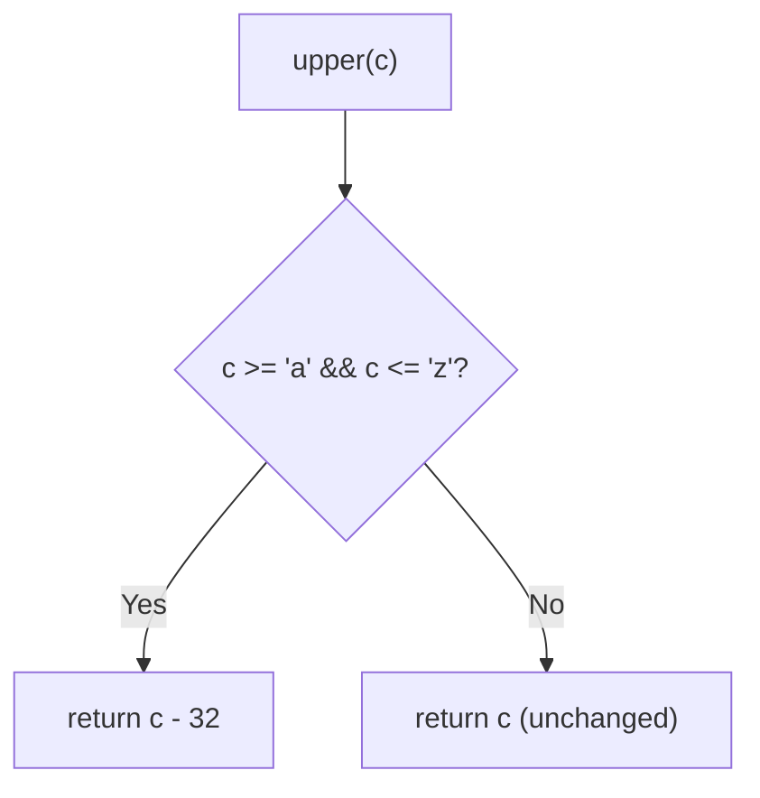
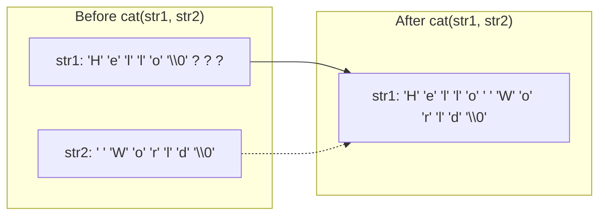
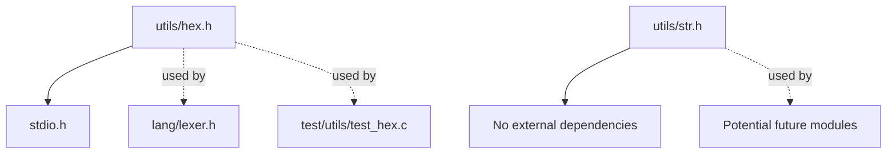

# Utilities Module (`lib/utils/`)

This module provides utility functions for hexadecimal conversion and string manipulation.

---

## 1. Hexadecimal Utilities (`hex.h`)

Functions for converting hexadecimal strings to integers and character case manipulation.

### Mermaid Diagram: Hex Conversion Flow





### API Reference

| Function | Description | Parameters | Return |
|----------|-------------|------------|--------|
| `val_hxchar(arg)` | Converts a hex character to its integer value (0-15) | `char arg` - hex digit | `int` - value 0-15 |
| `upper(c)` | Converts lowercase to uppercase | `int c` - character | `int` - uppercase char |
| `from_hex(hex[])` | Converts hex string to integer | `char hex[]` - hex string | `int` - decimal value |
| `is_letter(c)` | Checks if character is alphabetic | `char c` - character | `int` - 1 if letter, 0 otherwise |
| `hex_app()` | Interactive hex converter (reads from stdin) | none | `int` - 0 on success |

### Character Mapping



### Usage Example

```c
// Convert hex string to integer
int val = from_hex("0x40");  // Returns 64
int val2 = from_hex("0xa2"); // Returns 162

// Character conversion
char upper = upper('a');     // Returns 'A'
int digit = val_hxchar('f'); // Returns 15

// Interactive mode
hex_app();  // Prompts user for hex input
```

### `upper()` Function Detail



---

## 2. String Utilities (`str.h`)

Manual implementations of common string operations.

### Mermaid Diagram: String Operations

```mermaid
flowchart TD
    subgraph "len(str)"
        A1["i = 0"] --> A2["str[i] != '\\0'?"}
        A2 -->|Yes| A3["i++"]
        A3 --> A2
        A2 -->|No| A4["return i"]
    end

    subgraph "cat(str1, str2)"
        B1["val_len = len(str1)"] --> B2["str1 += val_len"]
        B2 --> B3["*str2 != '\\0'?"}
        B3 -->|Yes| B4["*str1 = *str2"]
        B4 --> B5["str1++, str2++"]
        B5 --> B3
        B3 -->|No| B6["Done"]
    end
```

### API Reference

| Function | Description | Parameters | Return |
|----------|-------------|------------|--------|
| `len(str)` | Calculates string length (like `strlen`) | `char* str` - null-terminated string | `int` - character count |
| `cat(str1, str2)` | Concatenates str2 to str1 (like `strcat`) | `char* str1` - destination (must have space)<br>`char* str2` - source | `void` |

### Memory Layout: `cat()` Operation



### Usage Example

```c
char buffer[50] = "Hello";
cat(buffer, " World");
// buffer now contains "Hello World"

int length = len(buffer);  // Returns 11
```

### Module Dependencies


